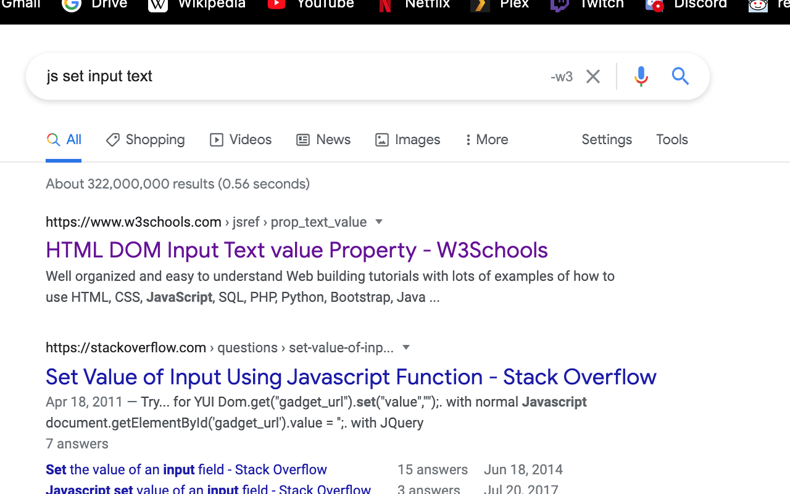
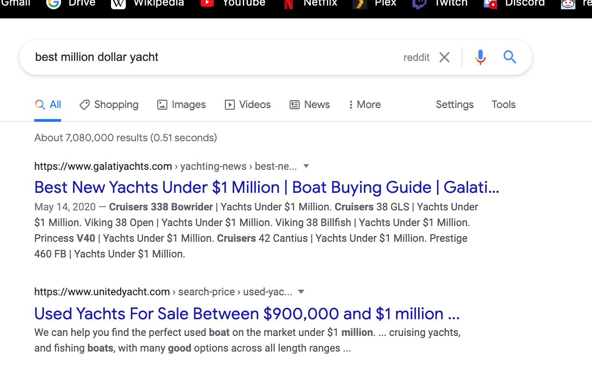

# Google Remix

Chrome extension that adds keywords to your query with the push of a button, after you've gotten your results.

Have you noticed how crappy Google's search results have become? I find myself adding "reddit", "github", and "-w3" to my searches with increasing frequency. Crappy SEO-optimized sites make search a multi-step process.

This extension compresses the search loop to a button push. Notice the "-w3" button:

And the "reddit" button:

The keywords appended depend on your search.

## Credits

Add Text (logo) by Filippo Gianessi from the Noun Project
