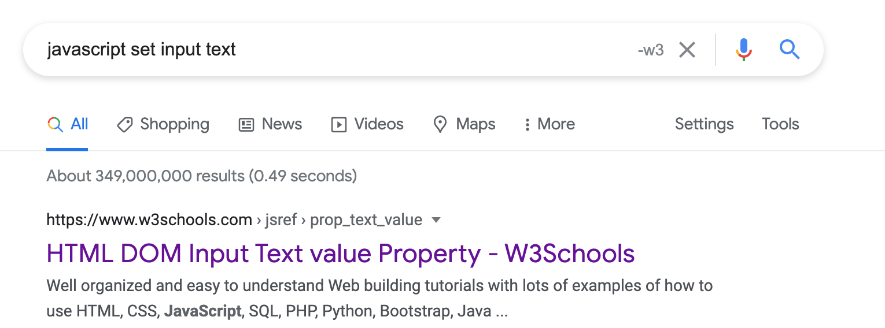

# Google Remix
## Make Google Great Again

Add "reddit" to your query with the push of a button.

Have you noticed how crappy Google's search results have become? I find myself adding "reddit", "github", and "-w3" to my searches with increasing frequency. Crappy SEO-optimized blogs make search a multi-step process.

This extension reduces this multi-search feedback loop to a button push. Notice the "-w3" button:

